<div align="center">

# befui

**Interfaces people actually enjoy using.**

137 copy-paste React components, 189 hand-drawn icons and 12 full-page blocks.<br/>
Built on Radix, Tailwind 4 and CSS variables. You own every file.

[](https://react.dev)
[](https://tailwindcss.com)
[](https://www.typescriptlang.org)
[](https://www.radix-ui.com)
[](LICENSE)

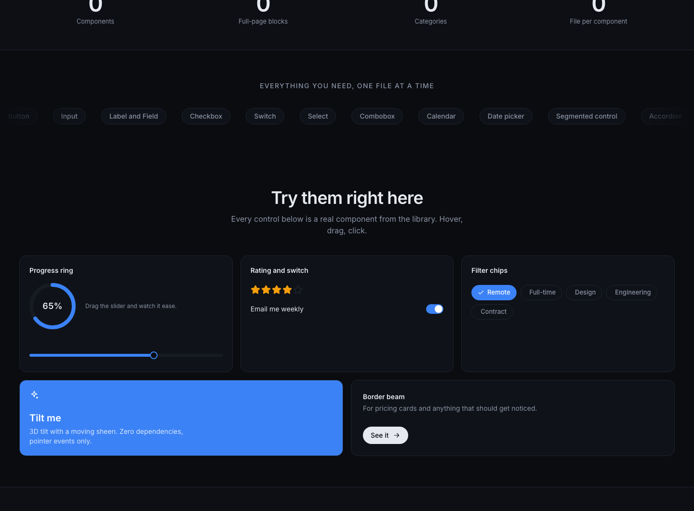

</div>

---

## Why befui

- **You own the code.** Every component is one file. The CLI copies it into your project, and from then on it is yours to edit. No package to upgrade or fight with.
- **Real motion, tastefully.** Smooth height animations, a cursor spotlight, a 3D tilt card, a magnifying dock, confetti, a circular theme reveal. All plain CSS and pointer events, all switched off for people who ask for reduced motion.
- **Accessible by default.** Radix handles focus, keyboard and ARIA for dialogs, menus, selects and tabs. The rest follow the same rules.
- **One variable rebrands everything.** Change `--primary` once. Light and dark both follow.
- **Global-ready.** Calendar and date pickers take a `locale`, and components use logical start/end spacing so they flip in right-to-left pages. Every docs preview has an RTL switch.
- **Our own icon set.** 189 icons on one grid with an opt-in draw animation. No icon package.
- **Built for AI coding tools.** `befui init` writes rules into your `AGENTS.md`, and the whole library is described in an `llms.txt` catalog, so an agent reuses components instead of retyping them.

## Quick start

In your app (Vite or similar, with Tailwind 4):

```bash
# 1. one time: theme, helper, and AI rules
npx github:RandomKid24/befui init          # add --force if you want it to replace an existing src/index.css

# 2. add what you need (its npm packages and any components it depends on come along)
npx github:RandomKid24/befui add button card data-table

# or take everything
npx github:RandomKid24/befui add all
```

```tsx
import { Button } from '@/components/ui/button';

export default function Page() {
  return <Button variant="soft" shape="pill">Save changes</Button>;
}
```

That is it. `init` also reminds you of the two config lines to add: the `@` import alias and `import './index.css'` in your entry file. If your project already has a `src/index.css` (Vite's template does), see step 4 of the guide. Full walkthrough in the [setup guide](#setup-guide-from-scratch) below.

## A look around

### Components, each with its own live preview and code

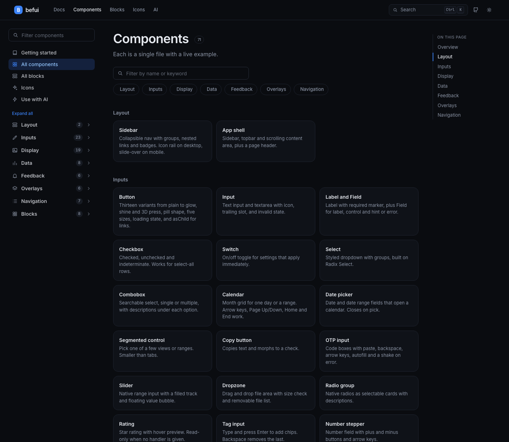

Every component page has a live preview, a Code tab, width and light/dark switches, copy-ready install commands and, for the key ones, a props **Playground**.

### Buttons: 13 variants, each with its own snippet

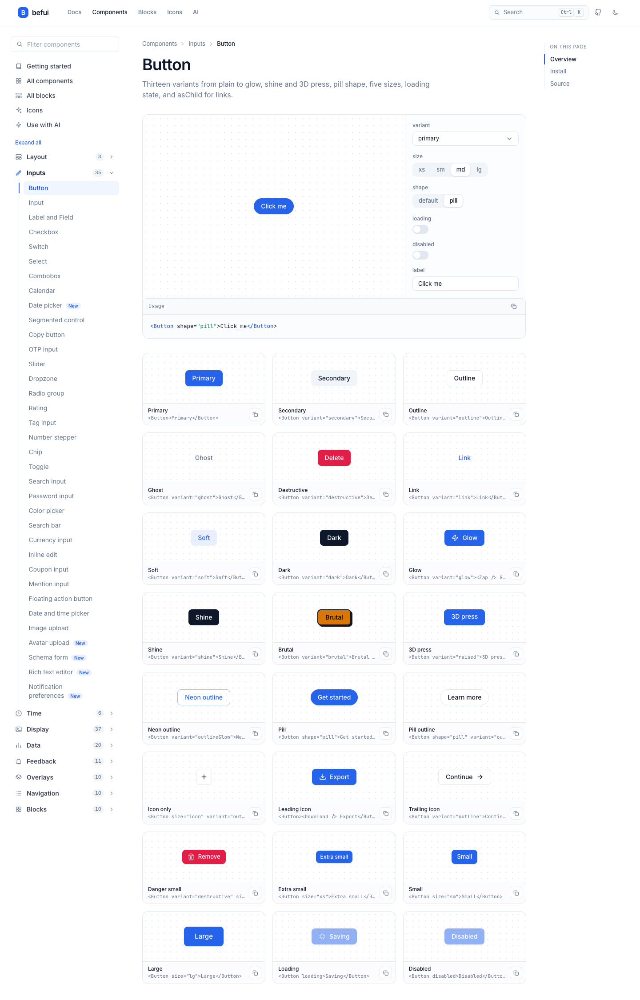

### Real components you can poke at

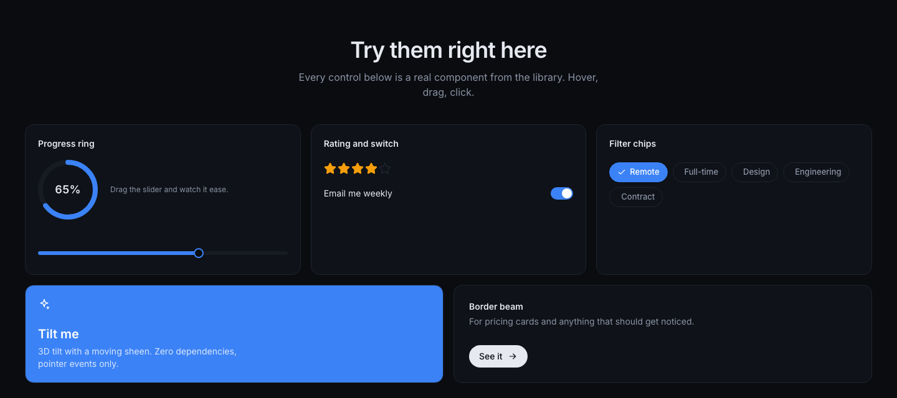

### A data table that sorts, filters and paginates

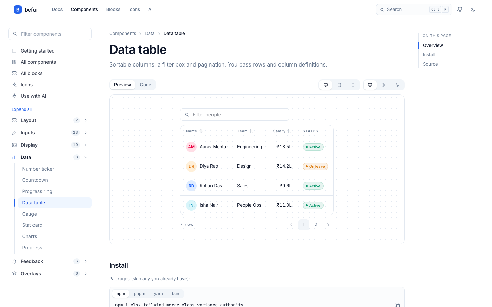

### A kanban board you can drag, or move with the keyboard

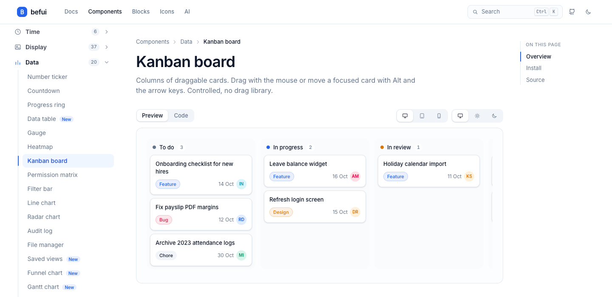

### A reports table with search, filters, sorting, row actions and a details drawer

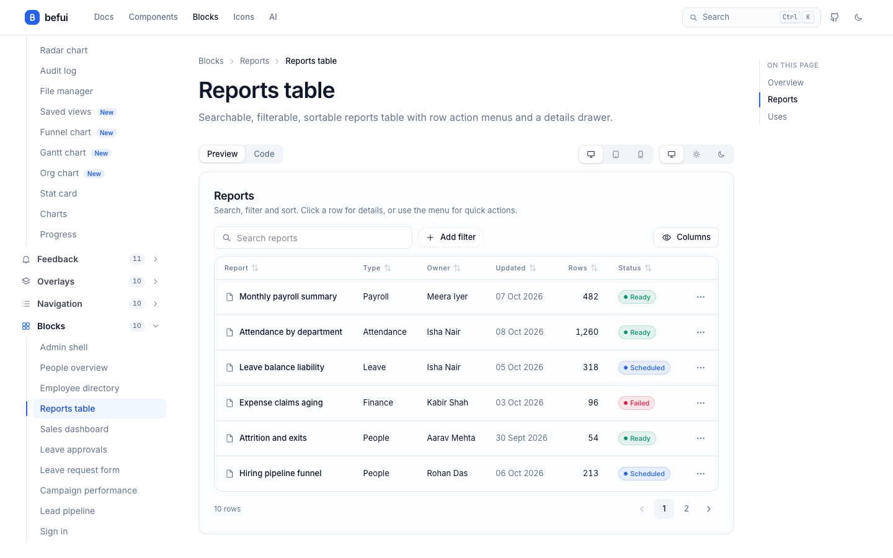

### A sales dashboard from stat cards, line chart, funnel and table


### 189 icons, drawn by us

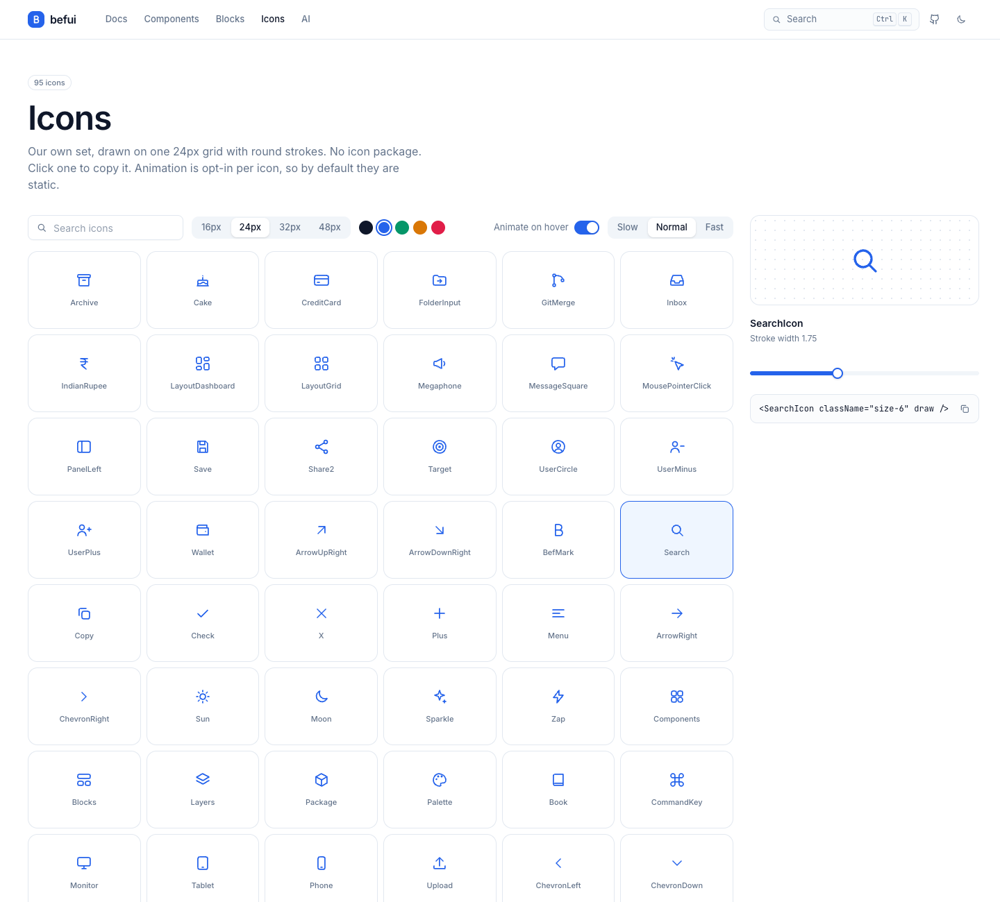

```tsx
import { SearchIcon, ArrowRightIcon } from '@/components/ui/icons';

<SearchIcon />                    {/* static, 16px, follows text color */}
<ArrowRightIcon draw />           {/* redraws on hover (opt-in) */}
<SearchIcon className="size-6" weight={2.5} />
```

### Time: pickers, clocks and timers

<table>
<tr>
<td width="50%">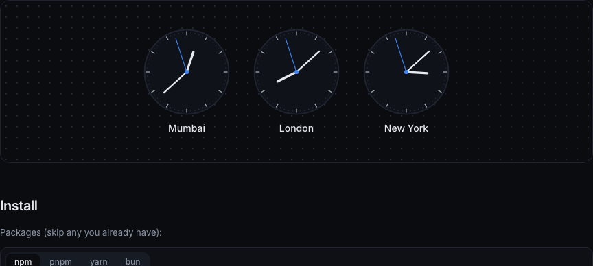</td>
<td width="50%">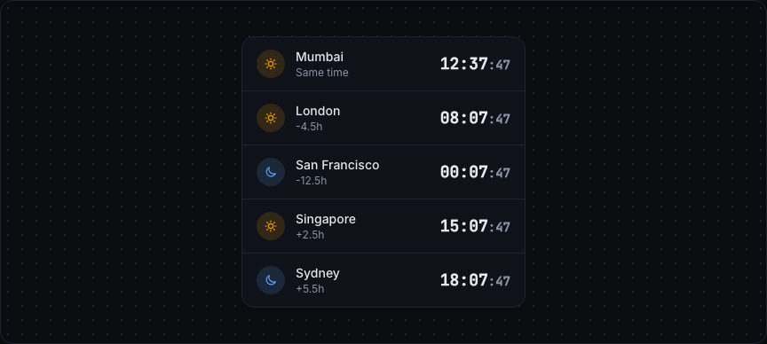</td>
</tr>
</table>

Time picker, analog clock, world clock, stopwatch, countdown timer and live relative time ("3 minutes ago").

### Whole screens

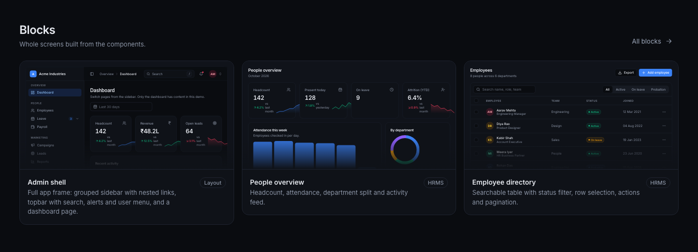

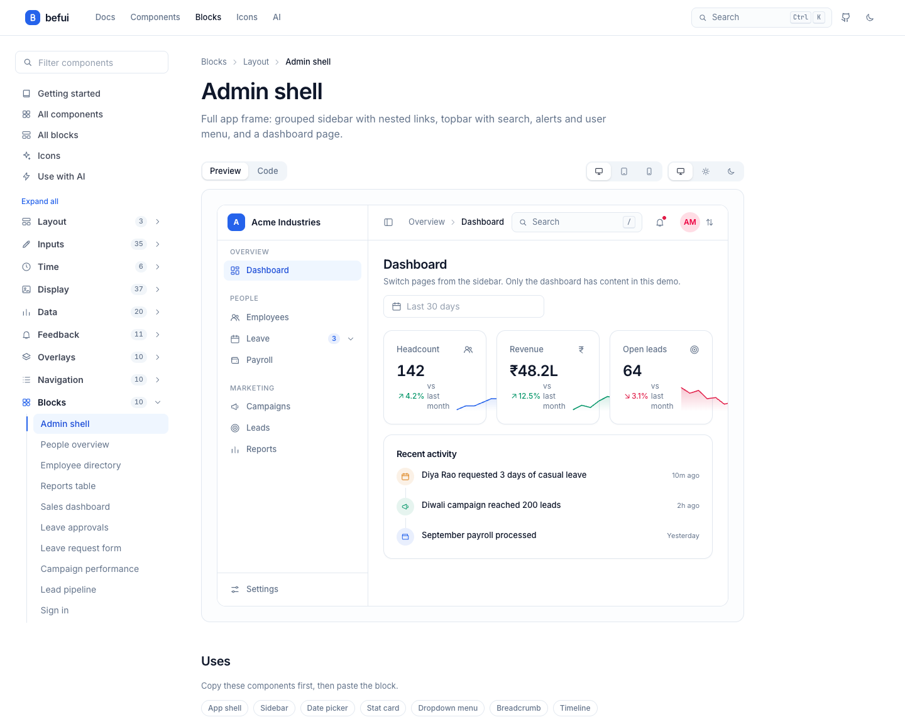

<table>
<tr>
<td width="50%">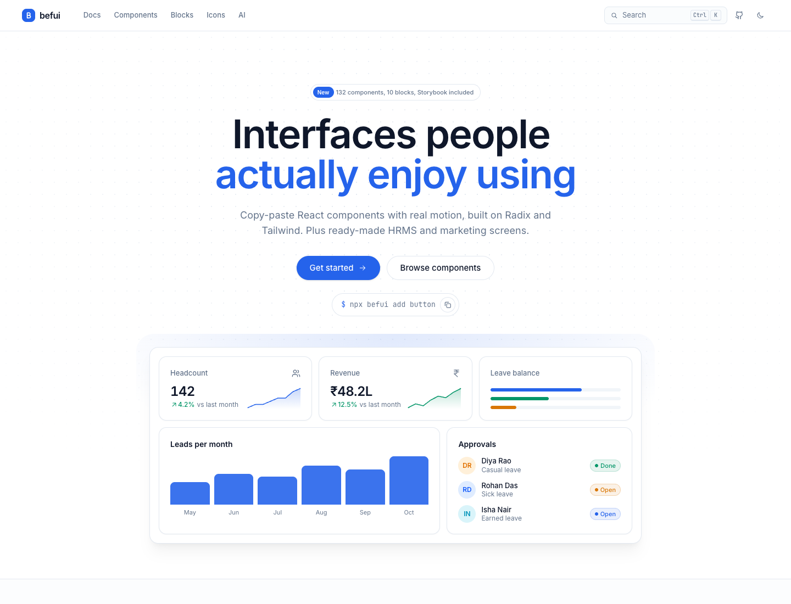<br/><sub>Light</sub></td>
<td width="50%">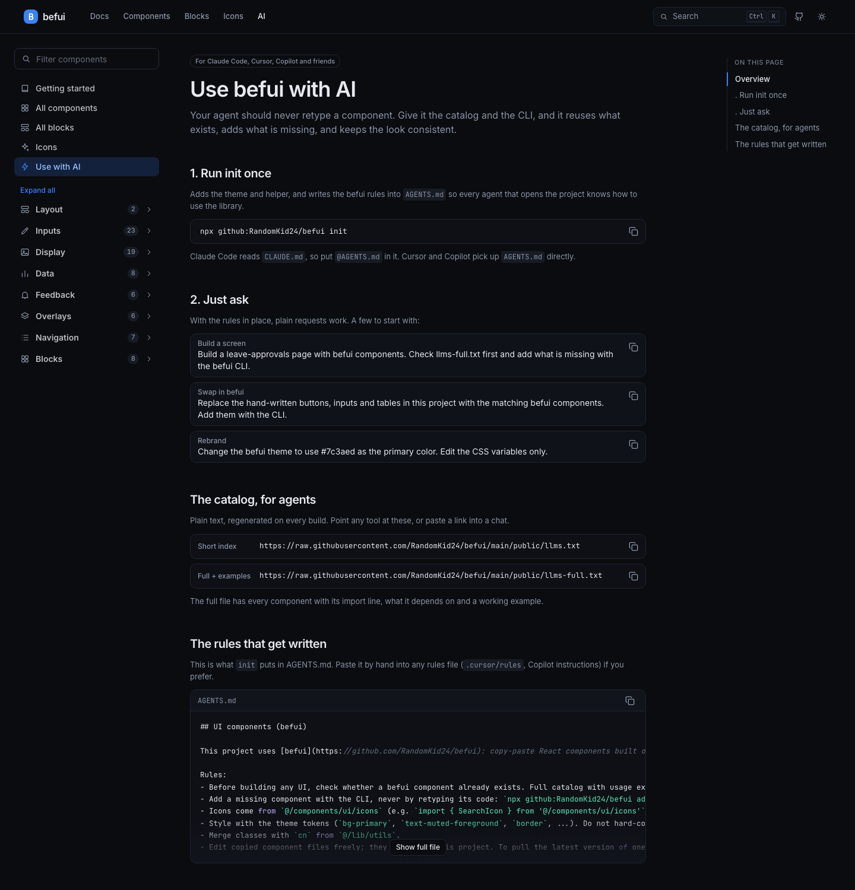<br/><sub>Use with AI</sub></td>
</tr>
</table>

## What is inside

### Theming notes

Everything follows the CSS variables in `index.css` (`--primary`, `--ring`, `--accent`...) and the `dark` class on `<html>`. A few pieces use fixed colors on purpose:
- `terminal` is always dark, like a real terminal, in both themes.
- `avatar` and `tag-manager` use fixed tint names (blue, green, violet, amber, rose) so a given name keeps the same color. Edit the `tones` list at the top of each file to match your brand.
- `product-card` discount tags use `destructive`, and `gantt`, `line-chart`, `radar-chart` use the semantic tokens (`primary`, `success`, `warning`, `info`).

### Releasing

Add a `## x.y.z` section to `CHANGELOG.md`, then `npm version minor` (checks the changelog), `git push --follow-tags` and `npm publish` (needs `npm login`; the package name `befui` is free on npm). `prepublishOnly` rebuilds the registry first.

### Keeping animations in sync

Some components (loader, bottom sheet, toast...) need keyframes from `index.css`. After adding components, run `npx github:RandomKid24/befui update` to append any your project is missing (`--check` only reports, handy in CI). `add` also prints a warning when something is missing.

### Components (137)

<details>
<summary><b>Layout</b> (3)</summary>

`sidebar` · `app-shell` · `split-pane`

</details>

<details>
<summary><b>Inputs</b> (37)</summary>

`button` · `input` · `label` · `checkbox` · `switch` · `select` · `combobox` · `calendar` · `date-picker` · `segmented` · `copy-button` · `otp-input` · `slider` · `dropzone` · `phone-input` · `signature-pad` · `radio-group` · `rating` · `tag-input` · `number-stepper` · `chip` · `toggle` · `search-input` · `password-input` · `color-picker` · `search-bar` · `currency-input` · `inline-edit` · `coupon-input` · `mention-input` · `fab` · `datetime-picker` · `image-upload` · `avatar-upload` · `schema-form` · `rich-text-editor` · `notification-preferences`

</details>

<details>
<summary><b>Time</b> (7)</summary>

`time-picker` · `analog-clock` · `world-clock` · `stopwatch` · `timer` · `relative-time` · `event-calendar`

</details>

<details>
<summary><b>Display</b> (38)</summary>

`accordion` · `spotlight-card` · `border-beam` · `marquee` · `reveal` · `carousel` · `compare` · `tilt-card` · `shimmer-text` · `collapsible` · `typewriter` · `pricing-card` · `card` · `badge` · `avatar` · `table` · `separator` · `kbd` · `empty-state` · `timeline` · `changelog` · `testimonial-card` · `comment-thread` · `code-block` · `status-dot` · `activity-feed` · `product-card` · `order-summary` · `sortable-list` · `chat` · `profile-card` · `terminal` · `swipe-actions` · `approval-flow` · `onboarding-checklist` · `tag-manager` · `format` · `version-log`

</details>

<details>
<summary><b>Data</b> (21)</summary>

`number-ticker` · `virtual-list` · `countdown` · `progress-ring` · `data-table` · `gauge` · `heatmap` · `stat-card` · `charts` · `progress` · `filter-bar` · `permission-matrix` · `kanban` · `line-chart` · `radar-chart` · `audit-log` · `file-manager` · `saved-views` · `funnel-chart` · `gantt` · `org-chart`

</details>

<details>
<summary><b>Feedback</b> (11)</summary>

`banner` · `confetti` · `alert` · `toast` · `skeleton` · `spinner` · `notification-center` · `cookie-consent` · `loader` · `error-state` · `pull-to-refresh`

</details>

<details>
<summary><b>Overlays</b> (10)</summary>

`alert-dialog` · `dialog` · `dropdown-menu` · `popover` · `tooltip` · `command` · `context-menu` · `image-viewer` · `bottom-sheet` · `shortcuts-dialog`

</details>

<details>
<summary><b>Navigation</b> (10)</summary>

`scroll-progress` · `tree-view` · `dock` · `tabs` · `breadcrumb` · `pagination` · `stepper` · `table-of-contents` · `navbar` · `bottom-nav`

</details>

Browse them live with search at the docs site, or run `npx github:RandomKid24/befui list`.

### Blocks (12)

Full screens built from the components, with mock data you swap for your own API.

| Block | Module | What it is |
|---|---|---|
| `block:admin-shell` | Layout | Full app frame: grouped sidebar with nested links, topbar with search, alerts and user menu, and a dashboard page. |
| `block:hrms-overview` | HRMS | Headcount, attendance, department split and activity feed. |
| `block:employee-directory` | HRMS | Searchable table with status filter, row selection, actions and pagination. |
| `block:reports-table` | Reports | Searchable, filterable, sortable reports table with row action menus and a details drawer. |
| `block:sales-dashboard` | Marketing | KPI cards, revenue line chart against target, pipeline funnel and a top deals table. |
| `block:leave-approvals` | HRMS | Manager inbox with tabs, balance bars and approve or reject toasts. |
| `block:leave-request-form` | HRMS | Date range, approver combobox, multi-select notify list, working-day count and field validation. |
| `block:campaign-performance` | Marketing | Channel KPIs, weekly leads chart and a campaign budget table. |
| `block:lead-pipeline` | Marketing | Drag-and-drop board with column totals and a keyboard-friendly move button. |
| `block:pricing-page` | Marketing | Headline, monthly or yearly switch, three plan cards with a highlighted one, and an FAQ. |
| `block:settings-page` | Account | Profile form with photo and phone number, notification switches and language and time zone, in tabs. |
| `block:sign-in` | Auth | Login card with validation, loading button and an error alert. |

### Icons (189)

Arrows, status, people, files, media, devices, commerce, charts, text formatting, maps and actions on a 24px grid, round strokes, one file. See them all on the Icons page of the site.

---

## Setup guide, from scratch

New to this? Follow these steps in a fresh project. Already have Tailwind 4 and the `@` alias? Skip to [Using components](#using-components).

**1. Create a Vite + React + TypeScript app**

```bash
npm create vite@latest my-app -- --template react-ts
cd my-app
```

**2. Install Tailwind 4**

```bash
npm i tailwindcss @tailwindcss/vite
```

**3. Add the `@` alias** (components import each other and the helper through `@/`)

`vite.config.ts`
```ts
import path from 'path';
import { defineConfig } from 'vite';
import react from '@vitejs/plugin-react';
import tailwindcss from '@tailwindcss/vite';

export default defineConfig({
  plugins: [react(), tailwindcss()],
  resolve: { alias: { '@': path.resolve(__dirname, 'src') } },
});
```

`tsconfig.app.json` (inside `compilerOptions`)
```json
"paths": { "@/*": ["./src/*"] }
```

You will also need `npm i -D @types/node` for the `path` import.

**4. Run init**

```bash
npx github:RandomKid24/befui init --force
```

`--force` is needed here because the Vite template already ships its own `src/index.css`, and without it `init` leaves that file alone and tells you it skipped. In a project where you have your own CSS, run plain `init` and paste the theme variables from `src/index.css` in this repo into yours instead.

This writes `src/index.css` (theme variables and animations), `src/lib/utils.ts` (the `cn` helper) and an `AGENTS.md` block for AI tools, and installs the shared packages.

**5. Make sure the CSS is imported once**

The Vite template already has this line in `src/main.tsx`. If yours does not, add it:

```tsx
import './index.css';
```

**6. Add a component and use it**

```bash
npx github:RandomKid24/befui add button dialog toast
```

```tsx
import { Button } from '@/components/ui/button';
import { Toaster, toast } from '@/components/ui/toast';

export default function App() {
  return (
    <>
      <Button onClick={() => toast.success('Saved')}>Save</Button>
      <Toaster />
    </>
  );
}
```

## Using components

- **Props are typed.** Your editor shows them. Variants use [`cva`](https://cva.style), so `variant`, `size` and friends autocomplete.
- **Override with `className`.** It is merged with `cn`, so your classes win over the defaults.
- **Some components need a provider or a root element.** `Toaster` goes once near the app root. `TooltipProvider` wraps anything that uses `Tooltip`. Each component page says so.
- **Compose them.** Blocks are just components arranged into a screen. Copy one with `add block:leave-approvals` and read how it is built.
- **Edit freely.** The files are in your repo. Change a padding, add a prop, delete what you do not use.

To pull the latest version of a component later:

```bash
npx github:RandomKid24/befui add button --force   # overwrites your local edits to that file
```

## Theming

Every color is a CSS variable in `src/index.css`. To rebrand, change four lines:

```css
:root {
  --primary: #7c3aed;
  --ring: #8b5cf6;
  --accent: #f5f3ff;
  --accent-foreground: #6d28d9;
}
```

Dark mode switches when `<html>` has the `dark` class:

```ts
document.documentElement.classList.toggle('dark');
```

Want the circular reveal the docs site uses? It is a few lines around `document.startViewTransition`, see `useTheme` in `src/site/layout.tsx`.

## CLI reference

| Command | What it does |
|---|---|
| `befui init` | Adds `index.css`, `lib/utils.ts`, installs shared packages and writes the AI rules to `AGENTS.md` |
| `befui add <name...>` | Copies components, plus the components and npm packages they need |
| `befui mcp` | Runs an MCP server so Claude Code, Cursor etc. can list, read and add components (`init` registers it in `.mcp.json`) |
| `befui add all` | Copies every component |
| `befui add block:<name>` | Copies a block (and what it uses) |
| `befui list` | Lists everything available |

| Flag | Meaning |
|---|---|
| `--dir <path>` | Target folder. Default `src` (or `.` if there is none) |
| `--force` | Overwrite files that already exist |
| `--no-install` | Print the npm packages instead of installing them |
| `--from <folder or url>` | Read the registry from somewhere else. Also `BEFUI_URL` |

Until the package is published to npm, run it as `npx github:RandomKid24/befui ...`. It detects npm, pnpm, yarn or bun from your lockfile.

## Using befui with AI

The library is set up so a coding agent (Claude Code, Cursor, Copilot) uses it correctly without hand-holding.

1. Run `npx github:RandomKid24/befui init`. It writes a marked block into `AGENTS.md` telling agents to reuse befui components, add missing ones with the CLI and use the theme tokens. Re-running refreshes only that block.
2. `init` also registers the **MCP server** in `.mcp.json` (restart your AI tool). Agents then get `list_components`, `get_component` (exact source, import, example) and `add_components` (use `all` for the whole library). Without `init`: `claude mcp add befui -- npx -y github:RandomKid24/befui mcp`.
3. **Claude Code** reads `CLAUDE.md`, so add the line `@AGENTS.md` to it. Cursor and Copilot read `AGENTS.md` directly.
4. Just ask: *"Build a leave-approvals page with befui. Check llms-full.txt first."*

The catalog for agents is plain text, regenerated on every build:

- [`public/llms.txt`](public/llms.txt): short index of every component
- [`public/llms-full.txt`](public/llms-full.txt): every component with its import line, dependencies and a working example

## Storybook

```bash
npm run storybook          # http://localhost:6006
npm run build-storybook    # static copy in dist-storybook
```

One story per component and block, generated from the same registry as the docs site. The toolbar has a light/dark switch and an accessibility panel.

## Run the docs site

```bash
git clone https://github.com/RandomKid24/befui
cd befui
npm install
npm run dev
```

| Script | Purpose |
|---|---|
| `npm run dev` | Docs site with hot reload |
| `npm run build` | Rebuilds the registry, typechecks and builds the site |
| `npm run typecheck` | TypeScript only |
| `npm run registry:build` | Regenerates `public/r/*.json`, `llms.txt` and `llms-full.txt` |
| `npm run stories:gen` | Regenerates the Storybook stories |
| `npm run storybook` | Storybook dev server |

## Project structure

```
src/
  components/ui/     the components, one file each (this is what gets copied)
  examples/          one demo per component, shown on its docs page
  blocks/            full-page blocks
  registry/index.ts  the list of components and blocks (docs, search, CLI and stories read it)
  site/              the docs site itself, built from the components above
  stories/           generated Storybook stories (do not edit)
public/r/            registry JSON the CLI downloads
public/llms*.txt     catalog for AI tools
bin/befui.mjs        the CLI
scripts/             registry, stories and AI-rules generators
```

## Contributing a component

1. Create `src/components/ui/<slug>.tsx`. Keep it to one file, import other befui files as `./other` and use the `cn` helper.
2. Create `src/examples/<slug>.tsx` with a default-exported demo.
3. Add an entry to `src/registry/index.ts`. The docs page, search, sidebar, CLI, llms files and Storybook story all come from it.
4. Run `npm run build`. It must pass.

Style rules we keep: use theme tokens (`bg-primary`, `text-muted-foreground`), never hard-coded colors; no gradients; respect `prefers-reduced-motion`; keyboard and screen-reader support are not optional.

## FAQ

**Is this an npm package?** Not yet. You copy files, or let the CLI copy them. That is the point: nothing to version-lock.

**What does it depend on?** React 19, Tailwind 4, Radix primitives for behavior, `lucide-react` for icons in the older components, and `cmdk` for the command palette and combobox. The newer components use our own icons, and the animated pieces need no libraries.

**Does it work with Next.js?** I have only tested it with Vite. The components are plain React and Tailwind, so it should work: add `'use client'` to files that use state or effects and set up the `@` alias in your `tsconfig`.

**How do I update a component?** `add <name> --force`, then re-apply any edits you made. Check `git diff` first.

**Where did the old experiments go?** `legacy/` holds the earlier motion demos. It is not part of the build.

## License

MIT. See [LICENSE](LICENSE).
